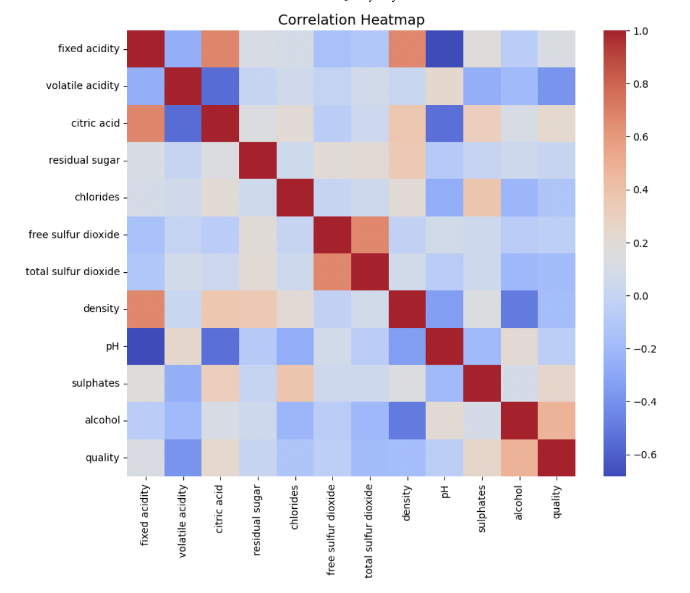

# 🍷 Wine Quality Prediction (Multiple Linear Regression)

### 🎯 Project Overview  
This project analyzes the chemical properties of wine and predicts its quality score using **Multiple Linear Regression (MLR)**.  
The goal is to identify which factors — such as alcohol, acidity, sulphates, and density — most strongly influence wine quality, and to evaluate the model's performance through diagnostic visualization.

本项目基于葡萄酒化学特征，使用 **多元线性回归 (MLR)** 来预测葡萄酒质量评分。  
通过模型拟合与可视化分析，识别影响酒质的关键因素并验证模型假设。

---

## 🧠 Workflow

### 1️⃣ Data Preprocessing
- Selected key features: `alcohol`, `volatile acidity`, `sulphates`, `citric acid`, `density`
- Cleaned and standardized the dataset
- Removed outliers using the IQR method

### 2️⃣ Model Building (OLS Regression)
- Built MLR model using `statsmodels`
- Achieved **R² ≈ 0.33**, indicating moderate explanatory power
- Significant variables:
  - ✅ `alcohol` (positive correlation)
  - ❌ `volatile acidity` (negative correlation)
  - ✅ `sulphates` (positive correlation)

### 3️⃣ Diagnostics & Validation
- Checked multicollinearity using VIF (all values < 5 ✅)
- Conducted residual analysis to verify linearity and homoscedasticity ✅
- Used QQ plot to confirm normality of residuals ✅

### 4️⃣ Visualization Highlights
- Feature Coefficient Bar Chart  
- Residual vs Fitted Plot  
- QQ Plot of Residuals  
- Predicted vs Actual Plot  
- Distribution Plot (Actual vs Predicted)

---

## 📊 Visualization Showcase  

| Visualization | Description |
|----------------|-------------|
| **Correlation Heatmap** | Displays correlations between wine features |
| **Pairwise Relationships** | Shows feature interactions and linear patterns |
| **Outlier Detection** | Identifies extreme values via boxplots |
| **Feature Coefficients (Bar Plot)** | Shows variable importance in regression |
| **Predicted vs Actual** | Evaluates prediction accuracy |
| **Distribution Plot** | Compares fitted and actual value distributions |

---

### Exploratory Data Analysis (EDA)
The dataset’s correlations and feature relationships were explored visually to understand which factors most influence wine quality.

**1. Correlation Heatmap**
This heatmap shows the relationship between all chemical properties and wine quality.  
We can observe that `alcohol` has the strongest positive correlation, while `volatile acidity` has a strong negative relationship.

---

**2. Pairwise Relationships**
Pairwise plots help visualize linear trends between variables and identify clusters or patterns.  
Here we can clearly see positive slopes between alcohol and quality, confirming the results of the regression model.

---

## 📈 Key Findings  

- Higher **alcohol content** significantly improves wine quality.  
- Higher **volatile acidity** negatively affects quality.  
- Higher **sulphate levels** enhance wine stability and perceived quality.  
- The model explains around **33% of total variance**, suggesting non-linear effects may exist.  

